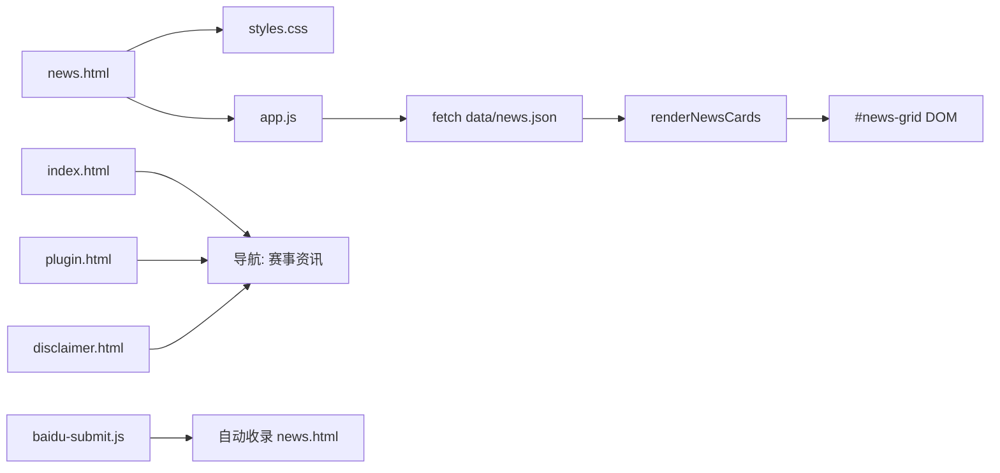

## 产品概述

在现有网站中新增「赛事资讯」页面（news.html），用于发布世界杯相关新闻内容，作为 SEO 流量入口。新闻内容通过 JSON 数据文件管理，方便随时更新。

## 核心功能

- **资讯列表展示**：以卡片网格形式展示新闻，每条包含配图、分类标签、标题、日期、摘要
- **分类筛选**：支持按新闻类型（前瞻/赛果/花絮/攻略等）快速过滤
- **Hero 区域**：展示页面标题和引导语，与现有 page-hero 风格统一
- **CTA 横幅**：底部引导用户返回首页或安装助手
- **导航入口**：在所有页面的主导航栏中添加「赛事资讯」链接

## 技术选型

- **页面结构**：纯静态 HTML，遵循现有手动复制 header/nav/footer 的组件模式
- **数据管理**：JSON 文件（`data/news.json`），与赛程 `data/matches.json` 模式一致
- **数据渲染**：app.js 中新增新闻渲染模块，fetch JSON 后动态生成卡片 DOM
- **样式方案**：在现有 `styles.css` 中追加新闻页样式，复用设计系统 CSS 变量

## 实现方案

### 整体策略

遵循现有 disclaimer.html 的页面模式：page-hero → section → card-grid → final-cta。新闻数据通过 fetch 加载 JSON 并由 JS 动态渲染，与赛程渲染逻辑并行但独立。

### 关键设计决策

1. **JSON 数据结构**：每条新闻包含 `id`、`title`、`date`、`category`、`summary`、`image`（可选的配图路径）、`tags`、`url`（可选的详情链接）
2. **分类标签系统**：前瞻→蓝色 `--blue`、赛果→红色 `--red`、花絮→金色 `--gold`、攻略→青色 `--cyan`、动态→绿色 `#10b981`
3. **渲染条件判断**：app.js 中通过检测 `#news-grid` 元素是否存在来决定是否执行新闻渲染，避免赛程页报错
4. **SEO 优化**：添加 description meta、页面标题含关键词，baidu-submit.js 自动收录

### 实现注意事项

- **性能**：新闻数据量小（5-10条），无需分页，单次 fetch 即可完成渲染
- **兼容性**：app.js 中赛程渲染逻辑以 `if (!grid) return;` 提前退出，新闻渲染同理，互不干扰
- **日志**：复用现有 fetch 错误处理模式，加载失败显示友好提示
- **版本号**：news.json 也带版本号参数 `?v=20260613-1`，支持 CDN 条件缓存

## 架构设计



## 目录结构

```
website/
├── news.html                  # [NEW] 赛事资讯页面。包含共享 header/nav/footer、Hero 区域（page-hero news-hero）、
│                              #   分类筛选栏（.news-filter-bar）、新闻卡片网格（#news-grid）、
│                              #   final-cta 横幅。meta 标签含 SEO 关键词。引入 app.js 和 pwa-register.js。
├── data/
│   └── news.json              # [NEW] 新闻数据文件。JSON 数组，每条包含 id/title/date/category/summary/image/tags/url。
│                              #   初始预置 6 条综合资讯（前瞻、赛果、花絮、攻略、动态各 1 条 + 1 条综合）。
├── styles.css                 # [MODIFY] 追加 ~150 行新闻页样式：
│                              #   .news-hero（Hero 背景）、.news-filter-bar（分类筛选按钮组）、
│                              #   .news-grid（3 列响应式卡片网格）、.news-card（卡片含配图、分类标签、标题、日期、摘要）、
│                              #   .news-category 颜色变体（前瞻/赛果/花絮/攻略/动态）、.news-card-image、
│                              #   .news-date、hover 上浮效果。响应式：平板 2 列，手机 1 列。
├── app.js                     # [MODIFY] 新增新闻渲染模块（在赛程渲染逻辑之后、导航下拉之前）：
│                              #   1. 检测 #news-grid 是否存在，不存在则跳过
│                              #   2. fetch data/news.json?v=NEWS_VERSION
│                              #   3. 实现 renderNews() 函数：按日期倒序排列、构建卡片 HTML、
│                              #      支持分类筛选点击切换、更新 #news-grid 内容
│                              #   4. 错误处理：显示"资讯暂时无法加载"
├── index.html                 # [MODIFY] 在 nav-links 末尾（免责声明之前）添加：
│                              #   <a href="news.html" class="nav-item">赛事资讯</a>
├── plugin.html                # [MODIFY] 同上，添加「赛事资讯」导航链接
└── disclaimer.html            # [MODIFY] 同上，添加「赛事资讯」导航链接
```

## 关键数据结构

```
// data/news.json 单条数据结构
{
  "id": "news-001",
  "title": "2026世界杯揭幕战：墨西哥对阵南非前瞻",
  "date": "2026-06-12",
  "category": "前瞻",
  "summary": "2026美加墨世界杯揭幕战即将打响，东道主墨西哥将在阿兹特克体育场迎战南非...",
  "image": "assets/news/opening-match.jpg",
  "tags": ["墨西哥", "南非", "揭幕战", "A组"],
  "url": ""
}
```

```css
/* 新闻分类标签颜色变量（在 :root 或新闻样式区域定义） */
.news-category-pre  { background: var(--blue); }   /* 前瞻 */
.news-category-result { background: var(--red); }   /* 赛果 */
.news-category-fun   { background: var(--gold); }   /* 花絮 */
.news-category-guide { background: var(--cyan); }   /* 攻略 */
.news-category-dynamic { background: #10b981; }     /* 动态 */
```

## Agent Extensions

### SubAgent

- **code-explorer**
- 用途：在实现阶段探索 styles.css 的精确插入位置、app.js 的模块边界，以及各 HTML 导航栏的具体行位置
- 预期结果：精确定位所有代码插入点，确保修改无误